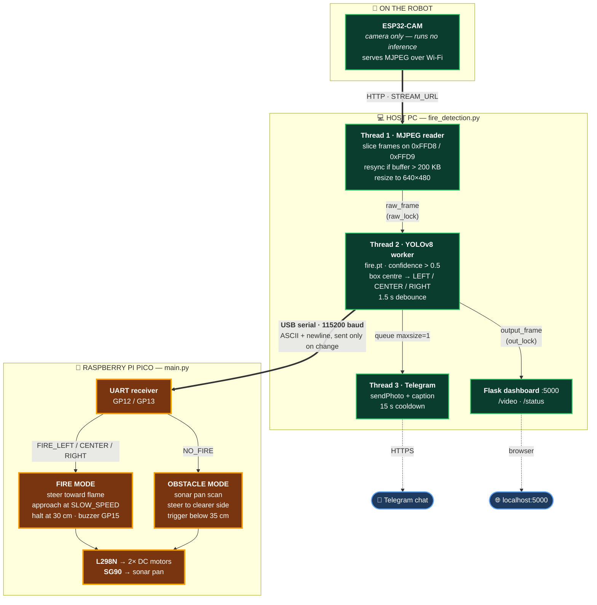
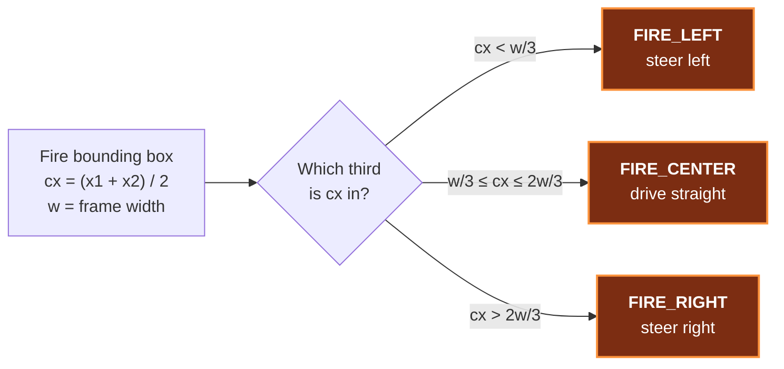
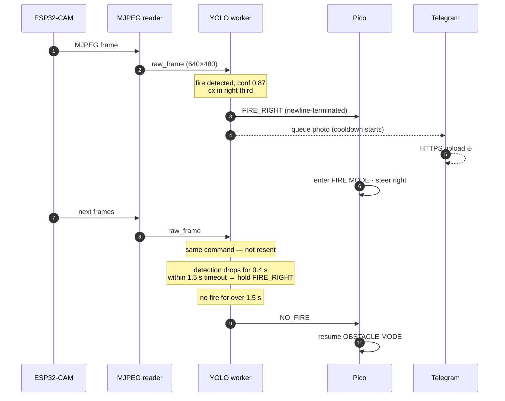
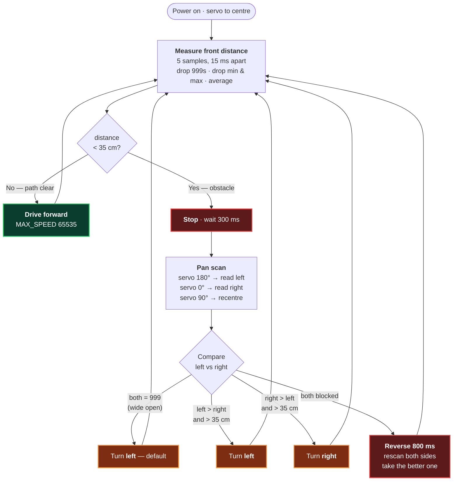

# AI-Driven Obstacle-Avoiding Smart Car

An autonomous two-wheeled robot car built on a Raspberry Pi Pico that avoids obstacles with an ultrasonic sonar, detects fire with a YOLOv8 model, drives toward the fire, and pushes photo alerts to Telegram.

Course project for **CSE 331L — Microprocessor Interfacing & Embedded System Lab**, North South University.

> **Status:** Stage 1 (obstacle avoidance) and the Stage 2 host service are complete and hardware-tested. The Stage 2 Pico firmware — [Second Stage/main.py](Second%20Stage/main.py) — was rebuilt from the spec after the original was lost, and is **not yet hardware-tested**. See [About `main.py`](#about-mainpy).

---

## How It Works

The system is split across **two processors** that talk over a serial link. This split is the central design decision of the project: the Pico is too small to run a neural network, so inference is offloaded to a laptop, and only a short text command travels back to the robot.



> 🟩 green = implemented and hardware-tested  🟧 amber = rebuilt from spec, **not yet hardware-tested** (see [About `main.py`](#about-mainpy))

### The control loop, step by step

1. **Capture.** The ESP32-CAM does nothing but serve an MJPEG stream over Wi-Fi. It runs no detection logic.
2. **Decode.** On the host, `mjpeg_reader()` accumulates bytes and slices out frames by scanning for the JPEG start (`0xFFD8`) and end (`0xFFD9`) markers. If the buffer passes 200 KB without a complete frame it resyncs to the last start marker, so a dropped packet cannot wedge the reader.
3. **Detect.** `yolo_worker()` runs `fire.pt` on each frame at confidence 0.5.
4. **Localise.** The frame is split into vertical thirds. The horizontal centre of the fire's bounding box picks the command:



5. **Debounce.** YOLO detection flickers frame to frame. `FIRE_TIMEOUT = 1.5 s` holds the last fire state after detection drops, so the robot does not lurch between fire mode and patrol mode on a single missed frame.
6. **Transmit.** `uart_send()` writes the command only when it *differs from the previous one*, keeping the serial line quiet and the Pico's parsing simple.
7. **Act.** The Pico switches mode on the received command — drive toward the fire, or resume obstacle avoidance.
8. **Alert.** In parallel, a Telegram photo goes out, rate-limited to one per 15 seconds. It is queued on a `maxsize=1` queue and sent from its own thread, so a slow upload never stalls detection.

### A single fire event, end to end



Two suppression rules keep this quiet: the command is written **only when it changes**, and the Telegram alert fires at most **once per 15 s**. Without them the Pico would be flooded at frame rate and the chat would be unusable.

### Why three threads

Each stage runs at a different natural speed, and blocking any one of them on another would drop frames:

| Thread | Blocks on | Consequence if inline |
| --- | --- | --- |
| `mjpeg_reader` | network socket | a Wi-Fi stall would freeze inference |
| `yolo_worker` | GPU/CPU inference | slow inference would back up the stream buffer |
| `telegram_worker` | HTTPS upload (up to 15 s) | one upload would block ~15 s of detection |

Frames are handed between them through two lock-guarded globals (`raw_frame`, `output_frame`) rather than queues, so a slow consumer simply reads the most recent frame instead of falling behind on a backlog.

---

## Repository Layout

```
First Stage/
  Obstacle_Avoiding_Car.py     Pico firmware — obstacle avoidance (COMPLETE)
  Circuit.jpg                  wiring reference photo
  To_Test_Components/
    obstacle robot.py          early prototype, kept for comparison
    servo_tester.py            SG90 sweep test
Second Stage/
  fire_detection.py            host service — YOLO + Flask + Telegram (COMPLETE)
  fire.pt                      custom-trained YOLOv8 fire model (22 MB)
  main.py                      Pico firmware — UART receiver (REBUILT, UNTESTED)
  Car.jpg                      assembled robot photo
.env.example                   configuration template
```

---

## About `main.py`

**The original was never committed — not here, and not upstream. The file in this repository is a rebuild.**

[Second Stage/main.py](Second%20Stage/main.py) was 0 bytes from the commit that added it, and the same file in the reference repository [`Shihab119/Ai-driven-fire-detection-robo-car`](https://github.com/Shihab119/Ai-driven-fire-detection-robo-car) is 0 bytes too. The firmware that ran during the demo was almost certainly flashed to the Pico from Thonny and never saved back into Git.

It is the other half of Stage 2, so its absence broke the system: `fire_detection.py` writes `FIRE_LEFT` / `FIRE_CENTER` / `FIRE_RIGHT` / `NO_FIRE` to the serial port, and nothing was reading them. [First Stage/Obstacle_Avoiding_Car.py](First%20Stage/Obstacle_Avoiding_Car.py) has no UART code at all.

The current file was written against the spec documented in the reference README — UART on GP12/GP13, `SLOW_SPEED = 20000`, `FIRE_STOP = 30 cm`, `SAFE_DIST = 35 cm`, buzzer GP15, servo GP16 — reusing the ultrasonic and servo routines from the Stage 1 controller, which are known good.

> ⚠️ **This is new code, not recovered code.** Its logic is unit-tested against stubbed hardware (UART framing, mode selection, motor duties, failsafe, shutdown), but **it has never driven the actual robot.** Treat the first run as bring-up, not a demo.

### Two decisions that depart from the spec

The reference README says the servo should *point toward the fire*. This firmware keeps the sonar **facing forward** during fire mode instead. Panning the sensor off-axis would measure the distance to whatever is beside the car, making the 30 cm halt condition meaningless — the car could drive into the flame with the sensor looking sideways. Steering comes from the host's direction instead, one short nudge per pass, so the car converges as the host keeps re-reporting.

The parts list specifies a **passive** buzzer, so GP15 is driven with PWM. The reference README says "active buzzer". If yours is active, swap `buzzer_on()` / `buzzer_off()` for `value(1)` / `value(0)` — there is a comment at the definition.

### First run

Do this **with the wheels off the ground**, chassis on a box:

1. Flash MicroPython, then upload the file to the Pico as `main.py`.
2. Power up with the host stopped. The car should patrol — wheels spinning forward, stopping and pan-scanning when you put your hand in front of the sonar.
3. Start `fire_detection.py` and show the camera a flame. Confirm the console prints `[UART] FIRE_CENTER` and the wheels slow to approach speed.
4. Cover the sonar to simulate arriving at the flame. Wheels should stop and the buzzer sound.
5. Kill the host process. Within ~3 s the car should print `link lost — reverting to patrol` and resume patrolling rather than driving on a stale bearing.

Only then put it on the floor. If the car will not move or pivot, raise `MAX_SPEED` / `TURN_SPEED` — Stage 1 needed 65535 / 50000 on the same chassis, while the spec values used here are 30000 / 40000.

---

## Hardware and Pin Map

Note the two stages use **different pin assignments for the servo**. Stage 1 drives it from GP0; the Stage 2 design moves it to GP16 to free low pins for UART and the buzzer.

| Function | Stage 1 (verified in code) | Stage 2 (documented spec) |
| --- | --- | --- |
| Servo signal (PWM 50 Hz) | **GP0** | **GP16** |
| HC-SR04 TRIG | GP2 | GP2 |
| HC-SR04 ECHO | GP3 | GP3 |
| L298N ENA (PWM 1 kHz) | GP4 | GP4 |
| L298N IN1 / IN2 | GP5 / GP6 | GP5 / GP6 |
| L298N IN3 / IN4 | GP7 / GP8 | GP7 / GP8 |
| L298N ENB (PWM 1 kHz) | GP9 | GP9 |
| UART TX / RX | — | GP12 / GP13 |
| Buzzer | — | GP15 |

### Components

Raspberry Pi Pico (RP2040) · ESP32-CAM with RHYX-M21-45 camera · ESP32-CAM programming base board · HC-SR04 ultrasonic sensor · SG90 servo · L298N dual H-bridge · passive buzzer · two-wheel chassis with caster · LM2596 buck converter · Li-ion pack · USB power bank.

**Power:** the Pico and its 5 V peripherals run from a USB power bank; the motor driver takes a separate feed from the Li-ion pack. The LM2596 buck module was tried first and could not hold 5 V under motor load — this caused erratic sonar readings and servo jitter until it was replaced. Never power the motors or servo from a Pico GPIO pin.


---

## Stage 1 — Obstacle Avoidance

Implemented in [First Stage/Obstacle_Avoiding_Car.py](First%20Stage/Obstacle_Avoiding_Car.py) and fully working.



**Distance measurement.** A 10 µs trigger pulse is sent, the echo pulse width is timed, and distance follows from the speed of sound:

```
distance_cm = echo_time_us × 0.0343 / 2
```

Each measurement averages `SAMPLES = 5` readings taken 15 ms apart — the HC-SR04 needs that gap to settle. Readings that time out return the sentinel `999` and are discarded; when more than three valid readings survive, the highest and lowest are dropped before averaging. This outlier rejection was added specifically because single spurious short readings were letting the robot drive into obstacles.

`ECHO_TIMEOUT = 38000 µs` covers the sensor's full 400 cm range with headroom, and prevents the two `while` loops from hanging forever if the sensor never responds. If *every* reading times out the result is `999`, treated as wide-open space.

**Servo duty values** for the SG90 at 50 Hz (20 ms period):

| Angle | Pulse | `duty_u16` | Direction |
| --- | --- | --- | --- |
| 0° | 0.5 ms | 1638 | look right |
| 90° | 1.5 ms | 4915 | look forward |
| 180° | 2.5 ms | 8192 | look left |

Each servo move waits 600 ms for the horn to physically arrive before the next reading is taken.

**Tuning constants:** `SAFE_DIST = 35 cm`, `MAX_SPEED = 65535` (full duty), `TURN_SPEED = 50000`, 50 ms main-loop delay. Raise `SAFE_DIST` toward 50 cm if the car still bumps obstacles — it needs enough runway to stop and turn.

> The earlier prototype at [First Stage/To_Test_Components/obstacle robot.py](First%20Stage/To_Test_Components/obstacle%20robot.py) uses a 10 cm threshold with a single unaveraged reading and no echo timeout. It is kept only to show the progression; do not run it. The project report's 15 cm figure is a historical test value, superseded by the 35 cm in the current code.

### Running Stage 1

1. Wire the Pico, L298N, servo, and HC-SR04 per the Stage 1 column of the pin map.
2. Flash MicroPython to the Pico.
3. Open `Obstacle_Avoiding_Car.py` in Thonny and run it on the device.
4. Watch the Thonny console — it prints front, left, and right distances each cycle.

Test the servo on its own first with [servo_tester.py](First%20Stage/To_Test_Components/servo_tester.py), which sweeps 0°–180° and recentres.

---

## Stage 2 — Fire Detection

The host service in [Second Stage/fire_detection.py](Second%20Stage/fire_detection.py) is complete and hardware-tested. The Pico half in [Second Stage/main.py](Second%20Stage/main.py) is a rebuild that still needs bench testing — see [above](#about-mainpy).

### UART protocol

Plain ASCII, newline-terminated, 115200 baud. Sent only on change.

| Command | Meaning |
| --- | --- |
| `FIRE_CENTER` | fire in the middle third — drive straight at it |
| `FIRE_LEFT` | fire in the left third — steer left |
| `FIRE_RIGHT` | fire in the right third — steer right |
| `NO_FIRE` | nothing detected — resume obstacle avoidance |

### Host constants

| Constant | Value | Purpose |
| --- | --- | --- |
| confidence threshold | 0.5 | minimum YOLO score to count as fire |
| `FIRE_TIMEOUT` | 1.5 s | holds fire state through detection dropouts |
| `TELEGRAM_COOLDOWN` | 15 s | minimum gap between alerts |
| frame size | 640×480 | every frame resized before inference |
| JPEG quality | 70 | dashboard stream re-encode |

### Web dashboard

Flask serves three routes on port 5000: `/` renders the dark-themed page, `/video` streams annotated frames as `multipart/x-mixed-replace`, and `/status` returns the current state as plain text, polled by the page once a second. Bounding boxes and the active command are drawn onto the frame before it is served.

### Running Stage 2

Requires Python 3 on a laptop with the ESP32-CAM reachable on the same network.

```bash
pip install ultralytics opencv-python numpy requests flask pyserial
```

Configuration is read from environment variables — never hard-code the bot token. Copy [.env.example](.env.example) and set the values in your shell:

```powershell
$env:BOT_TOKEN   = "your-telegram-bot-token"
$env:CHAT_ID     = "your-telegram-chat-id"
$env:STREAM_URL  = "http://<camera-ip>/stream"
$env:SERIAL_PORT = "COM5"
```

On Bash use `export NAME="value"`. Get `BOT_TOKEN` from [@BotFather](https://t.me/BotFather) and `CHAT_ID` from [@userinfobot](https://t.me/userinfobot). **If a token was ever committed or shared, revoke it and issue a new one.**

Then:

```bash
cd "Second Stage"
python fire_detection.py
```

Open `http://localhost:5000`. The service degrades gracefully — if the serial port is missing it logs the commands it *would* have sent instead of crashing, which makes it testable without the robot connected.

---

## Development Environment

| Tool | Used for |
| --- | --- |
| **Thonny + MicroPython** | Pico firmware — REPL, on-device file management, one-click run |
| **Python 3** | host service — YOLO inference, OpenCV, Flask, PySerial, Telegram |
| **Arduino IDE** | ESP32-CAM camera/stream firmware (not included in this repository) |

---

## Known Limitations

- **`main.py` is unverified on hardware.** The original was lost; the rebuild passes stubbed-hardware tests but has not driven the robot.
- **Detection is inconsistent** — accuracy varies with distance to the fire, viewing angle, and ambient light.
- **Inference is off-board.** The robot depends on a laptop and a Wi-Fi link; out of range, it is a plain obstacle-avoiding car.
- **No video recording.** The dashboard is live-only; nothing is persisted.
- **Front-facing sonar only.** One servo-panned sensor cannot see the sides or rear while moving.
- **No battery monitoring** — no level reporting and no low-battery alert.
- **The ESP32-CAM firmware is not in this repository.** The camera must already be serving MJPEG at `STREAM_URL`.

### Camera compatibility note

An ESP32-CAM with a standard OV2640 was purchased by mistake instead of the intended RHYX-M21-45 module. It produced corrupted JPEGs that could not be transmitted, and cost roughly two days of debugging aimed at the Telegram and Wi-Fi code before the camera hardware turned out to be the cause. The fix was the correct module plus the matching camera model in the firmware configuration.

---

## Future Work

- **Bench-test `main.py`** — the blocking item for an end-to-end demo.
- **Fire suppression** — add a water pump and reservoir so the car extinguishes rather than only reports.
- **On-board inference** — move to an edge device so the laptop is not required.
- **360° sensing** — multiple ultrasonic sensors or LiDAR.
- **GPS reporting** — include coordinates in the Telegram alert.
- **Battery management** — voltage monitoring and low-battery warnings.

---

## Cost

Total project cost was **BDT 3,818**, including the failed LM2596 buck module and the incorrectly purchased camera. A full line-item breakdown is in the project report.

---

## References

- [Raspberry Pi Pico Python SDK](https://www.raspberrypi.com/documentation/microcontrollers/)
- [ESP32-CAM datasheet](https://www.espressif.com/en/products/modules/esp32) · [Arduino-ESP32 core](https://docs.espressif.com/projects/arduino-esp32/)
- [Telegram Bot API](https://core.telegram.org/bots/api)
- [Ultralytics YOLOv8](https://github.com/ultralytics/ultralytics)
- [Thonny IDE](https://thonny.org) · [Arduino IDE](https://docs.arduino.cc/)
- [Random Nerd Tutorials — ESP32-CAM guides](https://randomnerdtutorials.com)
